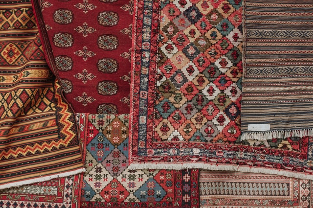
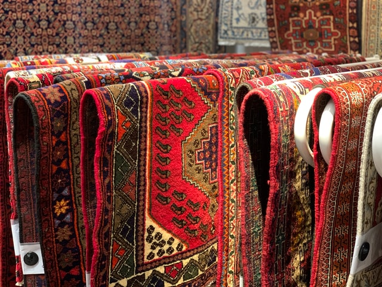
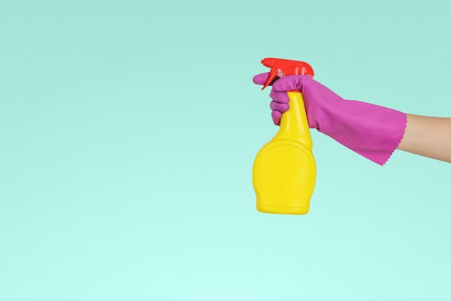

Izmed vsega pohištva, ki ga imamo doma preproga doživi največ neposredne uporabe,
katera prispeva h kopičenju umazanije in splošni obrabi. Zato je pomembno hraniti
preprogo čisto in dobro vzdrževano, ne samo, da bi izgledala nova, temveč tudi, da bi
povečali njeno življenjsko dobo. Domača preproga bi morala biti profesionalno
očiščena enkrat ali dvakrat letno, odvisno od tega koliko jo uporabljate. Lastniki
morajo poleg profesionalnih čiščenj posesati preprogo vsaj enkrat na teden.
Prednosti čiščenja preprog

## 1. Podaljša življenjsko dobo vaše preproge

Ena od glavnih prednosti profesionalnega čiščenja preprog je, da čiščenje pripomore k
podaljšanju življenjske dobe vaše preproge. Čez čas se zemlja, prah, umazanija in drugi
ostanki naberejo v preprogi ter se vgradijo v vlakna, kar lahko na koncu povzroči, da se
vlakna razcepijo in propadejo. Odstranjevanje umazanije in prahu bo pomagalo k
izboljšanju življenjske dobe preproge, saj se prah in ostali delci pogosteje držijo
umazane kakor čiste preproge. Profesionalni čistilci preprog po navadi uporabijo
čistilne metode, ki vsebujejo vroč vodni curek, da bi učinkovito odstranili umazanijo iz
globokih predelov med vlakni in pustili preprogo očiščeno. Lastniki bi lahko tudi
pomagali zmanjšati kopičenje umazanije v preprogi med profesionalnimi čiščenji in
sicer z rednimi sesanji.

 

## 2. Prispeva k bolj zdravemu okolju

Nekaj umazanije in prahu, ki se ujamejo v vlaknih preproge, lahko najde pot v vdihani
zrak, kjer lahko povzroči respiratorne probleme, alergijske reakcije in ostale zdravstvene
težave. Visoka temperatura vode, ki jo uporablja večina profesionalnih čistilcev preprog
ubije te alergene, tako da niso več zdravju škodljivi, preproga pa ostane popolnoma
čista.

 

## 3. Popolno odstranjevanje umazanije in bakterij

Čeprav je veliko lažje posesati doma kakor najeti čistilca, sesanje počisti le površinski
del. To pomeni, da bodo vse stvari, ki so vdelane v vlakna ostale tam, dokler ne bodo 
deležni profesionalne sanacije. Čez čas bo to povzročilo prekomerno obrabo vlaken in
hitrejše propadanje. Bakterije v preprogi lahko povzročijo tudi neprijetne vonjave. To
pomeni težje dihanje za tiste z astmo ali drugimi alergijami.

 

## 4. Odpravlja madeže na preprogah

Naslednja velika prednost zagotovljena s strani profesionalnih čistilcev je, da lahko
odstranijo trde madeže. Z uporabo toplega vodnega curka lahko strokovnjaki odstranijo
naslednje madeže:

- Polita kava
- Zemlja in blato
- Črnilo
- Živalski madeži
- Rdeče vino

Po strokovnem in profesionalnem čiščenju preprog, vas ne bi smelo skrbeti glede grdih
madežev ali da bi bili zasramovani pred gosti.

 

## 5. Brez ostankov

Medtem ko sesalci ne puščajo ostankov, nekatere naprave za čiščenje preprog jih. Če
je oprema stara ali cenejša, lahko postane neučinkovita in pusti nekaj čistila za seboj.
Po drugi strani je oprema, ki jo uporabljajo strokovnjaki vedno sodobna in uporablja
komercialna čistilna sredstva, da obnovi preproge, da bodo izgledale kot nove.
Uporabljajo tudi toplo vodo, da bi dosegli čim boljše rezultate ter očistili vlakna vseh
umazanij in madežev.

 

## 6. Zmanjša vpliv hoje na preproge

Preproge po katerih veliko hodimo, vključno s tistimi na hodniku, v dnevni sobi, kuhinji
itd., se bodo uničile veliko hitreje, kot tiste v spalnicah ali pod kavčem. To je zato, ker
se umazanija nenehno nahaja na teh površinah. Lahko ste celo opazili, da so ta območja
temnejša od ostalih.

Prednosti profesionalnih čiščenj preprog so, da bodo oni odstranili umazanijo in
upočasnili uničevanje zaradi hoje. Temni predeli preprog bodo bili odstranjeni in vlakna
bodo zopet obnovljena. 

## 7. Izboljša celoten videz sobe

Ali ste vedeli, da so preproge največje pohištvo v sobi. Prav tako se največ uporabljajo.
To je smiselno vendar kljub temu malo ljudi dejansko razmišlja o tem, koliko umazanije
in prahu nastane vsak dan.

Medtem ko nekdo mogoče sprva ne bo nič opazil, lahko čez čas soba izgleda umazana
in zastarela samo zaradi preproge. Strokovno čiščenje preprog pa ne samo da daje nov
izgled, temveč tudi izboljša estetiko v sobi.
Izbira profesionalne službe čiščenja preprog

Z nenehnim vzdrževanjem preprog in profesionalnim čiščenjem na letni ravni, lahko
izboljšate videz in podaljšate življenjsko dobo vaše preproge, s tem pa tudi prispevate
k bolj zdravemu okolju. Spomladansko obdobje je odličen čas, da profesionalno očistite
svojo preprogo, da bi odstranili umazanijo, ki je bila v vašem domu vso zimo.
Če ste zainteresirani za strokovno čiščenje vaših preprog, se obrnite na vaše lokalne
strokovnjake, da se dogovorite za termin čiščenja vašega doma. 